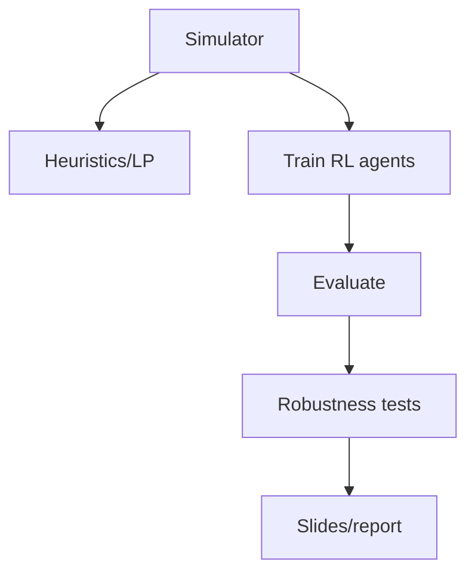

# Fleet Rebalancing with Reinforcement Learning — Presentation (Markdown)  
**Mihir — Reinforcement Learning**  

> Ready-to-present Markdown slide-style deck with RL algorithms for fleet rebalancing, routing example, objective functions, formulas, and flowcharts.

---

# Slide 1 — Title
**Fleet Rebalancing in Public Electric Mobility — RL approaches**  
Mihir — Reinforcement Learning  
Agenda: Problem recap → RL algorithms (concepts) → Routing example → Objective functions & formulas → Flowcharts & pseudocode → Q/A

---

# Slide 2 — Problem recap
We must re-position electric vehicles on a spatial grid to **minimize unserved ride requests** while respecting **State-of-Charge (SoC)**, travel-time / congestion, and charging constraints under stochastic demand.

---

# Slide 3 — Notation
- T : discrete time horizon (steps)  
- j ∈ R : regions, k : vehicles  
- J^t_j : demand forecast at region j at time t  
- ε^t_j : idle vehicles in region j at time t  
- x^t_{j←i} : vehicles moved from region i to j at time t  
- SoC^t_k : state of charge of vehicle k  
- τ^t_{ij} : travel time / congestion cost  
- (z)_+ := max(0,z)

---

# Slide 4 — RL concept
- **State s_t**: per-region features (idle, demand, SoC, chargers)  
- **Action a_t**: move/stay/charge (per-vehicle or aggregated flows)  
- **Transition**: update SoC, serve requests, new demand  
- **Reward r_t**: service level, fairness, energy cost, wait time  
- **Goal**: learn π(a|s) maximizing E[Σ γ^t r_t]

---

# Slide 5 — RL algorithm families
1. **DQN**: learns Q(s,a), small discrete actions  
2. **PPO/A2C**: policy gradient + value, handles large actions  
3. **CTDE (MADDPG/MAPPO)**: multi-agent centralized critic, decentralized actors  
4. **Hierarchical RL**: high-level flows, low-level routing  
5. **Model-based/MPC hybrid**: optimization + RL

---

# Slide 6 — Pros/Cons
- DQN: +simple, -scales poorly  
- PPO/A2C: +stable, large actions  
- MADDPG/MAPPO: +multi-agent scaling, needs credit assignment  
- Hierarchical/MPC: +efficient, needs design

---

# Slide 7 — Flowchart: RL training loop
```mermaid
flowchart TD
  A[Init policy π_θ] --> B[Run episodes in Sim]
  B --> C[Collect (s,a,r,s')]
  C --> D[Compute advantages]
  D --> E[Update π_θ (PPO/A2C)]
  E --> F{Converged?}
  F -->|No| B
  F -->|Yes| G[Deploy policy]
```

---

# Slide 8 — Flowchart: Online decision at time t
```mermaid
flowchart LR
  S[Observe s_t] --> P[Policy π -> actions a_t]
  P --> E[Execute moves x^t_{j←i}]
  E --> U[Update SoC, serve requests, reward r_t]
  U --> S2[Next state s_{t+1}]
```

---

# Slide 9 — Objective functions
Primary min-max unserved:  
min max_j ( J^t_j - (ε^t_j + Σ x^t_{j←i}) )_+  

RL reward:  
R = -Σ_t Σ_j ( J^t_j - (ε^t_j + Σ x^t_{j←i}) )_+ - λ_E Σ_t E_t  

Fairness-weighted:  
R = -Σ_t [ α max_j unserved_j + (1-α) Σ_j unserved_j ] - λ_E Σ_t E_t

---

# Slide 10 — PPO loss
L_CLIP(θ) = E[ min( r_t(θ) Â_t, clip(r_t(θ),1-ε,1+ε) Â_t ) ]  
r_t(θ) = π_θ(a_t|s_t) / π_old(a_t|s_t)  

Critic loss: L_VF(φ) = E[(V_φ(s_t) - R̂_t)^2]  
Total: L = L_CLIP - c1 L_VF + c2 H[π_θ]

---

# Slide 11 — Routing example (3×3 grid)
Center demand J=10, idle=2; neighbor SoC=0.8, τ=1  
Payoff = 0.8*(10-2)/(1+1) = 3.2 → strong move candidate

---

# Slide 12 — Reward example
Before: unserved=20; after moves: unserved=15, E_t=1.0, λ_E=0.1  
r_t = -15 - 0.1*1 = -15.1

---

# Slide 13 — Pseudocode env step
```python
def env_step(state, action):
    for i,j in edges:
        moved = action[i][j]
        state.epsilon[i] -= moved
        state.incoming[j] += moved
        energy += moved * energy_cost(i,j)
    unserved = {j: max(0, state.J[j] - (state.epsilon[j]+state.incoming[j])) for j in regions}
    reward = -sum(unserved.values()) - lambda_E * energy
    next_state = update(state, unserved, energy)
    return next_state, reward
```

---

# Slide 14 — Architecture & actions
- Per-vehicle discrete moves  
- Aggregated flows per region  
- Continuous flows + rounding

---

# Slide 15 — Training & evaluation
1. Build sim  
2. Baselines: payoff, greedy, LP  
3. Train PPO/MAPPO  
4. Metrics: worst & total unserved, wait, energy  
5. Sensitivity: forecast noise, chargers, scaling

---

# Slide 16 — Research pipeline

