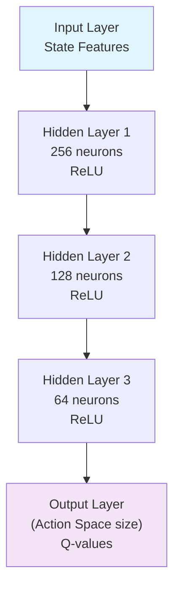

# Reinforcement Learning for Fleet Rebalancing
## A Comprehensive Approach to Electric Vehicle Optimization

---

## Agenda

1. **Introduction to Reinforcement Learning**
2. **RL Components & Framework**
3. **Fleet Rebalancing as RL Problem** 
4. **Illustrative Example: EV Routing & Scheduling**
5. **Objective Functions & Rewards**
6. **Algorithm Implementation**
7. **Results & Future Directions**

---

## 1. What is Reinforcement Learning?

### Definition
> **Reinforcement Learning (RL)** is a machine learning paradigm where an agent learns to make decisions by interacting with an environment to maximize cumulative reward.

### Key Characteristics
- **Learning through trial and error**
- **Sequential decision making**
- **Delayed rewards and consequences**
- **Balance between exploration and exploitation**

### Important RL Definitions

> **Policy Function (π(a|s)):**
A mapping from states to a probability distribution over actions. It defines how the agent behaves at a given time.

> **Q-value Function (Action-Value Function, Q(s,a)):**
The expected cumulative reward obtained by taking action a in state s and following policy π thereafter.

> **Value Function (V(s)):**
The expected cumulative reward from being in state s and following policy π.

### RL vs Other ML Approaches
| Aspect | Supervised Learning | Unsupervised Learning | **Reinforcement Learning** |
|--------|-------------------|---------------------|---------------------------|
| Data | Labeled examples | Unlabeled data | **Interaction & Feedback** |
| Goal | Predict outputs | Find patterns | **Maximize rewards** |
| Feedback | Immediate | None | **Delayed & sparse** |

---

## 2. RL Framework Components


### Core Components

#### **Agent** 
- The decision maker (EV fleet controller)
- Learns optimal policy π(a|s)

#### **Environment** 
- The urban mobility system
- City blocks, traffic, demand patterns

#### **State (S)**
- Current system configuration
- S = {EV locations, SoC levels, demand, congestion}

#### **Action (A)** 
- Decisions the agent can make
- A = {move EV, stay, serve request}

#### **Reward (R)** 
- Feedback signal for actions
- R = f(requests fulfilled, efficiency, costs)

---

## 3. Mathematical Framework

### State Transition
```
St+1 = f(St, At, Et)
```

Where:
- **St**: State at time t
- **At**: Action taken at time t  
- **Et**: Environmental randomness
- **f(·)**: Transition function

### Policy Function
```
π(a|s) = P(At = a | St = s)
```
The **policy** is the agent’s strategy: it tells us what action to take given a state.

### Value Functions

#### **State Value Function**
```
V^π(s) = E[∑(γ^k * Rt+k+1) | St = s]
```

#### **Action Value Function (Q-function)**
```
Q^π(s,a) = E[∑(γ^k * Rt+k+1) | St = s, At = a]
```
**Q-values** help the agent estimate the usefulness of actions in given states.

Where:
- **γ ∈ [0,1]**: Discount factor
- **E[·]**: Expected value

---

## 4. Fleet Rebalancing as RL Problem

### Problem Formulation

#### **State Space Definition**
```
St = {
    εt = [ε1t, ε2t, ..., εnt],     // Idle EVs per region
    Jt = [J1t, J2t, ..., Jnt],     // Ride requests per region  
    SoCt = [SoC1t, SoC2t, ..., SoCEt], // Battery levels
    τt = [τijt]                    // Congestion matrix
}
```

#### **Action Space Definition**
```
At = {
    xit→j ∈ {0,1,...,εit} : ∀i,j ∈ N, j ∈ Adj(i)
}
```

#### **Constraints**
- **Fleet conservation**: ∑i εit ≤ E
- **Adjacency**: Movement only between connected regions
- **SoC constraint**: SoCkt ≥ threshold for movement

---

## 5. Illustrative Example: 3×3 Grid EV Scheduling

### Scenario Setup
- **Grid**: 9 regions (R0 to R8)
- **Fleet**: 10 electric vehicles
- **Objective**: Minimize failed ride requests over time horizon

```
Grid Layout:
┌─────┬─────┬─────┐
│ R0  │ R1  │ R2  │
├─────┼─────┼─────┤
│ R3  │ R4  │ R5  │
├─────┼─────┼─────┤
│ R6  │ R7  │ R8  │
└─────┴─────┴─────┘
```

### State Representation at t=0
| Region | Idle EVs | Requests | SoC Avg | Failed |
|--------|----------|----------|---------|--------|
| R0     | 2        | 6        | 0.75    | 4      |
| R1     | 1        | 4        | 0.68    | 3      |
| R2     | 0        | 5        | -       | 5      |
| R3     | 2        | 3        | 0.82    | 1      |
| R4     | 3        | 6        | 0.71    | 3      |

### Action Example: Multi-Step Routing
```
Step 1: R4 → R2 (Move 1 EV, high demand)
Step 2: R3 → R0 (Move 1 EV, balance load) 
Step 3: R1 → R2 (Move 1 EV, critical shortage)
```

---

## 6. Reward Function Design

### Multi-Objective Reward Function

```
Rt = -α₁ × max(Failed_Requestst) 
     -α₂ × ∑(Failed_Requestst) 
     -α₃ × ∑(Movement_Costst)
     +α₄ × Service_Efficiencyt
```
α-values tune the importance of each term.
Can use Reward Shaping:


#### **Component Breakdown**

| Component | Formula | Weight | Purpose |
|-----------|---------|---------|---------|
| **Max Failed** | `max_j(max(0, Jⱼᵗ - εⱼᵗ))` | α₁=10 | Minimize worst-case |
| **Total Failed** | `∑ⱼ max(0, Jⱼᵗ - εⱼᵗ)` | α₂=5 | Overall efficiency |
| **Movement Cost** | `∑ᵢⱼ xᵢⱼᵗ × τᵢⱼᵗ × SoC_cost` | α₃=2 | Energy conservation |
| **Service Rate** | `∑ⱼ min(Jⱼᵗ, εⱼᵗ) / ∑ⱼ Jⱼᵗ` | α₄=15 | Reward fulfillment |

### Reward Shaping
```
Rt_shaped = Rt + Φ(St+1) - Φ(St)
```
Where Φ(S) is a potential function guiding exploration.


---

## 7. Q-Learning Algorithm Flow

```mermaid
flowchart TD
    A[Initialize Q-table] --> B[Observe State S<sub>t</sub>]
    B --> C{ε-greedy Action Selection}
    C -->|Explore: ε| D[Random Action]
    C -->|Exploit: 1-ε| E["Action = argmax Q(s,a)"]
    D --> F[Execute Action A<sub>t</sub>]
    E --> F
    F --> G[Observe Reward R<sub>t+1</sub> & State S<sub>t+1</sub>]
    G --> H[Update Q-value]
    H --> I{Episode Complete?}
    I -->|No| B
    I -->|Yes| J[Update ε, α]
    J --> K{Converged?}
    K -->|No| A
    K -->|Yes| L[Output Optimal Policy]
    
    style A fill:#e8f5e8
    style L fill:#ffe8e8
```



### Q-Learning Update Rule

```
Q(St, At) ← Q(St, At) + α[Rt+1 + γ max_a Q(St+1, a) - Q(St, At)]
```

**Parameters:**
- **α ∈ (0,1]**: Learning rate
- **γ ∈ [0,1]**: Discount factor  
- **ε**: Exploration rate (ε-greedy) chooses random action with probability ε, best-known action otherwise.

---

### PPO (Proximal Policy Optimization) — Definition

- PPO is a policy gradient method that updates the policy in small, controlled steps to prevent performance collapse.
- Uses a clipped objective to limit how much the new policy can deviate from the old one.
- Works well for large/continuous action spaces.

## 8. Deep Q-Network (DQN) Architecture

**DQN (Deep Q-Network)** replaces the Q-table with a neural network to approximate **Q(s,a)**.
This allows RL to work with **high-dimensional and continuous state spaces**.

### Neural Network Structure

```mermaid
flowchart TB
    %% Environment
    Env[Environment]:::env -->|Observe State s_t| States[States]:::state

    %% Agent block
    subgraph Agent[AGENT]
        direction TB
        NN[/"Deep Neural Network\nInput Layer → Hidden Layer 1 → Hidden Layer 2 → Output Layer"/]:::nn
        Policy[Optimal Policy]:::policy
        States --> NN --> Policy
    end

    Policy -->|Optimal Action a_t| Env
    Env -.->|Reward r_t| NN

    %% Styles
    classDef env fill:#c8e6c9,stroke:#2e7d32,stroke-width:2px;
    classDef state fill:#c8e6c9,stroke:#2e7d32,stroke-width:2px;
    classDef nn fill:#e3f2fd,stroke:#1565c0,stroke-width:2px;
    classDef policy fill:#c8e6c9,stroke:#2e7d32,stroke-width:2px;
```




### State Preprocessing
```python
def preprocess_state(raw_state):
    features = [
        normalize(idle_evs),           # EV distribution
        normalize(requests),           # Demand pattern
        normalize(soc_levels),         # Battery states
        flatten(congestion_matrix),    # Traffic info
        time_features(current_time)    # Temporal context
    ]
    return np.concatenate(features)
```

### Loss Function
```
L(θ) = E[(yt - Q(st, at; θ))²]

where: yt = rt+1 + γ max_a' Q(st+1, a'; θ⁻)
```

---

## 9. Implementation Pseudocode

```python
# Fleet Rebalancing RL Algorithm
def train_fleet_rebalancing_agent():
    
    # Initialize
    Q_network = DQN(state_dim, action_dim, hidden_dims)
    target_network = DQN(state_dim, action_dim, hidden_dims)
    replay_buffer = ReplayBuffer(capacity=10000)
    
    for episode in range(max_episodes):
        state = env.reset()
        total_reward = 0
        
        for t in range(max_steps):
            # ε-greedy action selection
            if random.random() < epsilon:
                action = env.action_space.sample()
            else:
                action = argmax(Q_network(state))
            
            # Execute action
            next_state, reward, done = env.step(action)
            
            # Store transition
            replay_buffer.add(state, action, reward, next_state, done)
            
            # Training step
            if len(replay_buffer) > batch_size:
                batch = replay_buffer.sample(batch_size)
                loss = compute_dqn_loss(batch, Q_network, target_network)
                optimizer.step()
            
            # Update state
            state = next_state
            total_reward += reward
            
            if done: break
        
        # Update target network periodically
        if episode % target_update_freq == 0:
            target_network.load_state_dict(Q_network.state_dict())
        
        # Decay exploration
        epsilon = max(epsilon_min, epsilon * epsilon_decay)
    
    return Q_network
```

---

## 10. Performance Metrics & Results

### Key Performance Indicators

| Metric | Formula | Target |
|--------|---------|--------|
| **Service Rate** | `Fulfilled_Requests / Total_Requests` | > 85% |
| **Max Failed Requests** | `max_j(Failed_j)` | < 3 |
| **Fleet Utilization** | `Active_EVs / Total_Fleet` | > 70% |
| **Energy Efficiency** | `Requests_Served / SoC_Consumed` | Maximize |

### Expected Learning Curve


---

## 11. Advanced RL Techniques

### Multi-Agent Reinforcement Learning (MARL) : Multiple agents learn concurrently, sometimes cooperating or competing.
```
- Each EV as independent agent
- Cooperative vs. competitive scenarios
- Communication protocols
- Scalability challenges
```

### Hierarchical RL Breaks a problem into sub-policies for different abstraction levels.


### Transfer Learning Uses knowledge from one task/environment to speed up learning in another.
- **Pre-trained models** from similar cities
- **Domain adaptation** for different traffic patterns
- **Few-shot learning** for new regions


#### **1. Federated RL** 🤝
```
Multiple cities collaboratively train models
while preserving data privacy
```

#### **2. Causal RL** 🔗
```
Understanding cause-effect relationships
in urban mobility patterns
```

#### **3. Safe RL** 🛡️
```
Ensuring safety constraints during exploration
Risk-aware decision making
```

---


## Appendix: Mathematical Notation

| Symbol | Description | Domain |
|--------|-------------|--------|
| **St** | State at time t | S |
| **At** | Action at time t | A |
| **Rt** | Reward at time t | ℝ |
| **π(a\|s)** | Policy function | [0,1] |
| **Q^π(s,a)** | Action-value function | ℝ |
| **V^π(s)** | State-value function | ℝ |
| **γ** | Discount factor | [0,1] |
| **α** | Learning rate | (0,1] |
| **ε** | Exploration rate | [0,1] |
| **εit** | Idle EVs in region i at time t | ℕ |
| **Jit** | Requests in region i at time t | ℕ |
| **τij** | Congestion from region i to j | ℝ⁺ |

---

