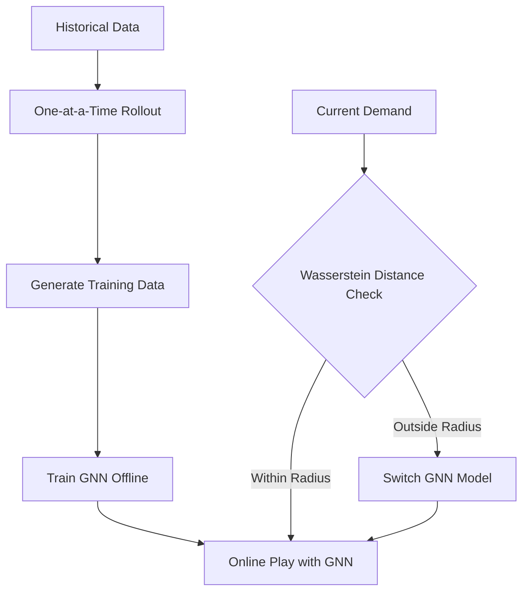
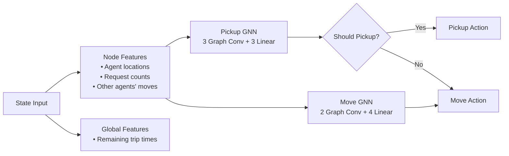
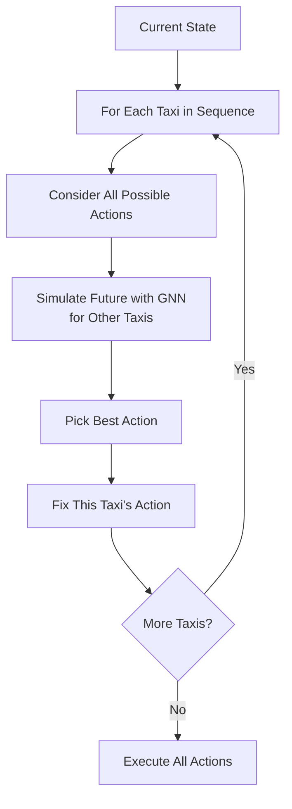
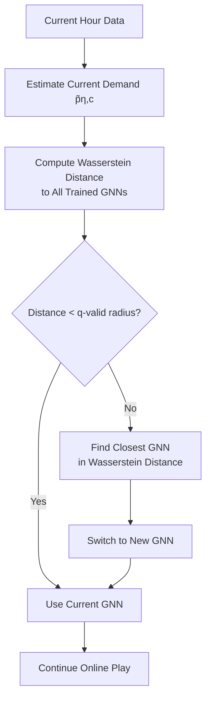

# Multiagent Reinforcement Learning for Autonomous Taxi Routing and Pickup Problem with Adaptation to Variable Demand

## Title & Introduction
**Multiagent Reinforcement Learning for Autonomous Taxi Routing**
*with Adaptation to Variable Demand*


---

## Problem Overview

### Real-World Challenge
- **Fleet of autonomous taxis** serving customers in a city
- **Random customer requests** appear over time
- **Goal:** Minimize total waiting time for all customers

### Key Difficulties
- **Stochastic demand**: Don't know when/where future requests appear
- **Combinatorial explosion**: Multiple taxis × multiple actions
- **Changing patterns**: Rush hour vs midnight demand

---

## Technical Problem Setup

### Environment Model
```
City Map = Graph G = (V, E)
- V: Intersections (nodes)
- E: Streets (directed edges)
- Travel time: 1 minute per edge
```

### Request Definition
**Request r = (ρᵣ, δᵣ, kᵣ, φᵣ)**
- **ρᵣ**: Pickup location (intersection)
- **δᵣ**: Drop-off location
- **kᵣ**: Arrival time
- **φᵣ**: Assignment status (0=unassigned, 1=assigned)

---

## Mathematical Formulation

### State Representation
**State xₖ = (νₖ, τₖ, r̄ₖ)**
- **νₖ**: Taxi locations at time k
- **τₖ**: Remaining service times
- **r̄ₖ**: Outstanding (waiting) requests

### Objective Function
**Minimize:** Total waiting time = Σ |r̄ₖ| over time horizon

### Challenge: Curse of Dimensionality
- **State space**: O(|V|ᵐ × (|V|²)^|requests|)
- **Control space**: Exponential in number of taxis
- **Exact solution**: Computationally intractable

---

## Core Algorithm Components

### Three-Part Hybrid Approach



---

## Component 1 - One-at-a-Time Rollout

### Problem with Standard Rollout
- **Joint optimization**: All taxis simultaneously
- **Complexity**: 5^m possible actions (exponential!)
- **Example**: 3 taxis → 125 combinations, 10 taxis → 9.7 million

### One-at-a-Time Solution
1. **Sequential optimization**: Optimize taxis one by one
2. **For Taxi 1**: Consider all actions, assume others follow base policy
3. **For Taxi 2**: Fix Taxi 1's decision, assume rest follow base policy
4. **Continue** for all taxis
5. **Complexity**: Linear in m (not exponential!)

---

## Why One-at-a-Time Works

### Coordination Example
**Scenario**: 2 taxis (T1, T2), 2 requests (R1, R2)

#### Greedy (Myopic)
- T1 → Nearest request
- T2 → Nearest request
- **Problem**: Both might go to same request!

#### One-at-a-Time Rollout
- **T1 decision**: Considers what T2 will likely do
- **T2 decision**: Knows T1's choice, optimizes accordingly
- **Result**: Better coordination, lower waiting time

---

## Component 2 - Graph Neural Networks (GNN)

### Why GNNs?
- **City = Graph structure**: Intersections connected by roads
- **GNNs exploit topology**: Learn spatial relationships
- **Scalable**: Handle different map sizes

### Two-Network Architecture



---

## Component 3 - Online Play

### Concept: Approximate Policy Iteration
- **Base policy**: Use GNN predictions for other taxis
- **Current taxi**: Do one-step lookahead with base policy
- **Advantage**: Improves GNN performance in real-time

### Online Play Process


---

## Distribution Shift Problem

### Challenge: Demand Changes Over Time
- **Training**: GNN learns from historical data (e.g., morning rush)
- **Runtime**: Current demand might differ (e.g., late night)
- **Result**: GNN gives poor predictions → Online play fails

### Example Scenarios
- **Peak hours**: High demand downtown
- **Off-peak**: Scattered requests
- **Events**: Concerts, sports games
- **Seasonal**: Weather, holidays

---

## Solution - Wasserstein Ambiguity Sets

### Key Concepts

#### Wasserstein Distance
- **Measures**: "Work" to transform one distribution into another
- **Intuition**: Moving probability mass in space
- **Advantage**: Considers geometric structure (not just probabilities)

#### q-Valid Radius
- **Definition**: Radius θ around training distribution
- **Guarantee**: Current demand lies within radius with probability ≥ q
- **Formula**: θ ≥ (B + 0.75)(√(-log(1-q)/X) + 2√(-log(1-q)/X))

---

## Adaptive Switching Mechanism

### Process Flow


### Benefits
- **Automatic adaptation**: No manual intervention
- **Principled switching**: Based on statistical guarantees
- **Performance recovery**: Maintains online play advantages

---

## Experimental Setup

### Dataset
- **Source**: San Francisco taxi data (CRAWDAD)
- **Small map**: 400×400m², 42 nodes, 125 edges, 3 taxis
- **Large map**: 1500×1500m², 825 nodes, 1884 edges, 15 taxis

### Demand Models
- **Low demand**: E[η]·N = 3 requests/hour
- **Medium demand**: E[η]·N = 9 requests/hour  
- **High demand**: E[η]·N = 25 requests/hour

### Training Details
- **Data**: 1.2M state-action pairs
- **Epochs**: 100
- **Training time**: 16h (move), 6h (pickup) on RTX A6000

---

## Benchmark Comparisons

### Evaluated Methods
1. **Greedy**: Nearest-request assignment (myopic)
2. **One-at-a-time rollout**: Reference planner (expensive)
3. **GNN alone**: Offline approximation only
4. **Online play + GNN**: Our hybrid method
5. **Instantaneous assignment**: Deterministic matching
6. **TSS**: Two-step stochastic optimization
7. **Oracle**: Perfect future knowledge (lower bound)

### Evaluation Metric
- **Normalized wait time**: [0,1] scale using min-max normalization
- **Average**: Over 50 random starting configurations

---

## Results - In-Distribution Performance

### When Current = Training Demand

| Method | Low Demand | Medium Demand | High Demand |
|--------|------------|---------------|-------------|
| **Greedy** | 0.94 | 0.99 | 1.0 |
| **Rollout** | 0.62 | 0.65 | 0.58 |
| **GNN alone** | 0.58 | 0.68 | 0.65 |
| **Online play + GNN** | **0.57** | **0.62** | **0.50** |
| **Oracle** | 0.0 | 0.0 | 0.0 |

### Key Findings
- **Online play + GNN**: Best performance across all scenarios
- **Improvement**: 8-14% better than rollout
- **Consistency**: Maintains advantage across demand levels

---

## Results - Out-of-Distribution Robustness

### Performance vs Wasserstein Distance

| Method | Distance: 0.0 | 0.017 | 0.067 | **0.117** | 0.15 | 0.35 |
|--------|---------------|--------|--------|-----------|------|------|
| **GNN (low)** | 0.62 | 0.62 | 0.73 | **0.74** | 0.98 | 1.0 |
| **Online play** | 0.61 | 0.57 | 0.63 | **0.73** | 0.68 | 0.52 |

*q-valid radius = 0.114*

### Observations
- **Within radius** (≤0.067): Excellent performance
- **Outside radius** (>0.117): Performance degrades
- **Switching recovery**: 9% improvement when switching GNNs

---

## Scalability Results

### Large Map Performance (825 nodes, 15 taxis)

| Demand | Greedy | Inst. Assign | Our Method | Oracle |
|--------|---------|-------------|------------|---------|
| **Low** | 1.0 | 0.86 | **0.77** | 0.0 |
| **Medium** | 1.0 | 0.86 | **0.83** | 0.0 |
| **High** | 1.0 | 0.99 | **0.89** | 0.0 |

### Scalability Adaptations
- **Certainty Equivalence**: Reduced stochastic simulations
- **Auction-based base**: Instantaneous assignment starting point
- **Fewer samples**: 2000 vs 5000 Monte Carlo per leaf

---

## Technical Contributions

### Novel Aspects
1. **Hybrid Architecture**: Offline GNN + Online optimization
2. **Principled Adaptivity**: Wasserstein Ambiguity Sets for switching
3. **Scalable Rollout**: One-at-a-time for linear complexity
4. **Graph-based Learning**: GNN exploits city topology

### Theoretical Guarantees
- **Rollout improvement**: One-at-a-time guarantees better than base
- **Online play**: Approximate policy iteration properties
- **Statistical validity**: q-valid radius with probability guarantees

---

## Limitations & Future Work

### Current Limitations
- **Single passenger**: No ride-sharing capability
- **Fixed travel times**: No traffic/congestion modeling
- **Training cost**: Expensive GNN preparation offline
- **Reactive switching**: Responds to changes, doesn't predict

### Future Directions
1. **Proactive switching**: Predict demand changes
2. **Multi-passenger**: Ride-sharing extensions
3. **Dynamic travel times**: Traffic-aware routing
4. **Hierarchical scaling**: Regional decomposition for large cities

---

## Key Takeaways

### Main Results
✅ **Outperforms** rollout and OR benchmarks on real taxi data  
✅ **Adapts automatically** to changing demand patterns  
✅ **Scales linearly** with number of taxis (vs exponential)  
✅ **Real-time capable** through offline-online hybrid approach  

### Practical Impact
- **Ride-sharing companies**: Better customer experience
- **Urban planning**: Efficient fleet management  
- **Autonomous vehicles**: Coordinated routing strategies
- **General multi-agent**: Template for other domains

### Method Applicability
- Package delivery, warehouse robots, emergency response
- Any scenario with: multiple agents, stochastic demand, coordination needs

---
