# Multiagent Reinforcement Learning for Autonomous Taxi Routing and Pickup Problem with Adaptation to Variable Demand

## Title & Introduction
**Multiagent Reinforcement Learning for Autonomous Taxi Routing**
*with Adaptation to Variable Demand*


---

## Problem Overview

### Real-World Challenge
- **Fleet of autonomous taxis** serving customers in a city
- **Random customer requests** appear over time
- **Goal:** Minimize total waiting time for all customers

### Key Difficulties
- **Stochastic demand**: Don't know when/where future requests appear
- **Combinatorial explosion**: Multiple taxis × multiple actions
- **Changing patterns**: Rush hour vs midnight demand

---

## Technical Problem Setup

### Environment Model
```
City Map = Graph G = (V, E)
- V: Intersections (nodes)
- E: Streets (directed edges)
- Travel time: 1 minute per edge
```

### Request Definition
**Request r = (ρᵣ, δᵣ, kᵣ, φᵣ)**
- **ρᵣ**: Pickup location (intersection)
- **δᵣ**: Drop-off location
- **kᵣ**: Arrival time
- **φᵣ**: Assignment status (0=unassigned, 1=assigned)

---

## Mathematical Formulation

### State Representation
**State xₖ = (νₖ, τₖ, r̄ₖ)**
- **νₖ**: Taxi locations at time k
- **τₖ**: Remaining service times
- **r̄ₖ**: Outstanding (waiting) requests

### Objective Function
**Minimize:** Total waiting time = Σ |r̄ₖ| over time horizon

### Challenge: Curse of Dimensionality
- **State space**: O(|V|ᵐ × (|V|²)^|requests|)
- **Control space**: Exponential in number of taxis
- **Exact solution**: Computationally intractable

---

## Core Algorithm Components

### Three-Part Hybrid Approach

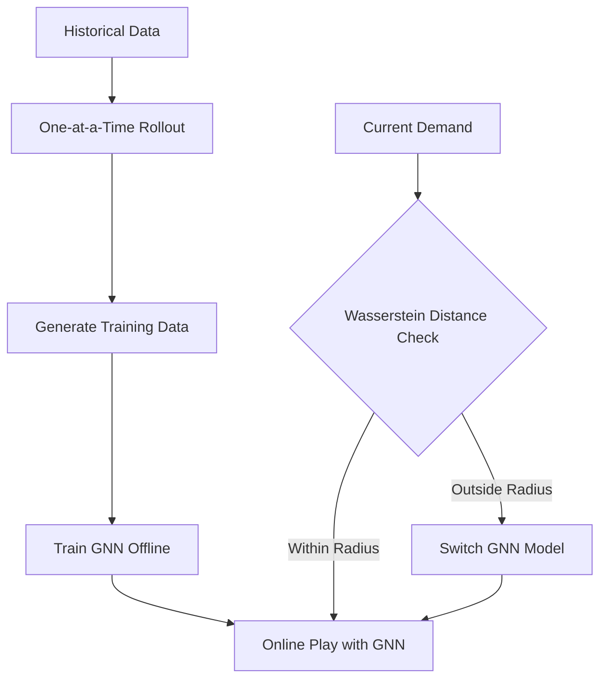
```mermaid
graph TD
    A[Historical Data] --> B[One-at-a-Time Rollout]
    B --> C[Generate Training Data]
    C --> D[Train GNN Offline]
    D --> E[Online Play with GNN]
    F[Current Demand] --> G{Wasserstein Distance Check}
    G -->|Within Radius| E
    G -->|Outside Radius| H[Switch GNN Model]
    H --> E
```

---

## Component 1 - One-at-a-Time Rollout

### Problem with Standard Rollout
- **Joint optimization**: All taxis simultaneously
- **Complexity**: 5^m possible actions (exponential!)
- **Example**: 3 taxis → 125 combinations, 10 taxis → 9.7 million

### One-at-a-Time Solution
1. **Sequential optimization**: Optimize taxis one by one
2. **For Taxi 1**: Consider all actions, assume others follow base policy
3. **For Taxi 2**: Fix Taxi 1's decision, assume rest follow base policy
4. **Continue** for all taxis
5. **Complexity**: Linear in m (not exponential!)

---

## Why One-at-a-Time Works

### Coordination Example
**Scenario**: 2 taxis (T1, T2), 2 requests (R1, R2)

#### Greedy (Myopic)
- T1 → Nearest request
- T2 → Nearest request
- **Problem**: Both might go to same request!

#### One-at-a-Time Rollout
- **T1 decision**: Considers what T2 will likely do
- **T2 decision**: Knows T1's choice, optimizes accordingly
- **Result**: Better coordination, lower waiting time

---

## Component 2 - Graph Neural Networks (GNN)

### Why GNNs?
- **City = Graph structure**: Intersections connected by roads
- **GNNs exploit topology**: Learn spatial relationships
- **Scalable**: Handle different map sizes

### Two-Network Architecture

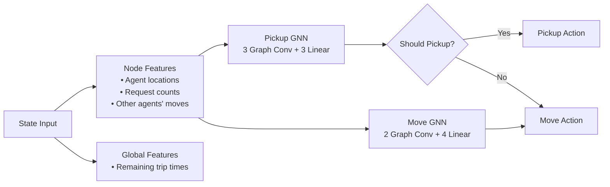
```mermaid
graph LR
    A[State Input] --> B[Node Features<br/>• Agent locations<br/>• Request counts<br/>• Other agents' moves]
    A --> C[Global Features<br/>• Remaining trip times]
    B --> D[Pickup GNN<br/>3 Graph Conv + 3 Linear]
    B --> E[Move GNN<br/>2 Graph Conv + 4 Linear]
    D --> F{Should Pickup?}
    F -->|Yes| G[Pickup Action]
    F -->|No| H[Move Action]
    E --> H
```

---

## Component 3 - Online Play

### Concept: Approximate Policy Iteration
- **Base policy**: Use GNN predictions for other taxis
- **Current taxi**: Do one-step lookahead with base policy
- **Advantage**: Improves GNN performance in real-time

### Online Play Process
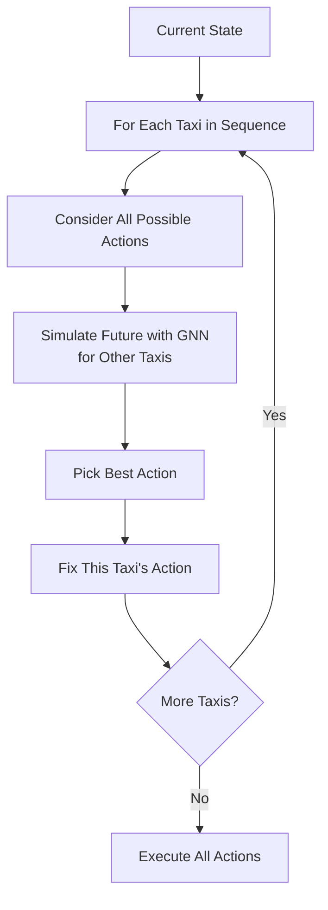
```mermaid
graph TD
    A[Current State] --> B[For Each Taxi in Sequence]
    B --> C[Consider All Possible Actions]
    C --> D[Simulate Future with GNN<br/>for Other Taxis]
    D --> E[Pick Best Action]
    E --> F[Fix This Taxi's Action]
    F --> G{More Taxis?}
    G -->|Yes| B
    G -->|No| H[Execute All Actions]
```

---

## Distribution Shift Problem

### Challenge: Demand Changes Over Time
- **Training**: GNN learns from historical data (e.g., morning rush)
- **Runtime**: Current demand might differ (e.g., late night)
- **Result**: GNN gives poor predictions → Online play fails

### Example Scenarios
- **Peak hours**: High demand downtown
- **Off-peak**: Scattered requests
- **Events**: Concerts, sports games
- **Seasonal**: Weather, holidays

---

## Solution - Wasserstein Ambiguity Sets

### Key Concepts

#### Wasserstein Distance
- **Measures**: "Work" to transform one distribution into another
- **Intuition**: Moving probability mass in space
- **Advantage**: Considers geometric structure (not just probabilities)

#### q-Valid Radius
- **Definition**: Radius θ around training distribution
- **Guarantee**: Current demand lies within radius with probability ≥ q
- **Formula**: θ ≥ (B + 0.75)(√(-log(1-q)/X) + 2√(-log(1-q)/X))

---

## Adaptive Switching Mechanism

### Process Flow
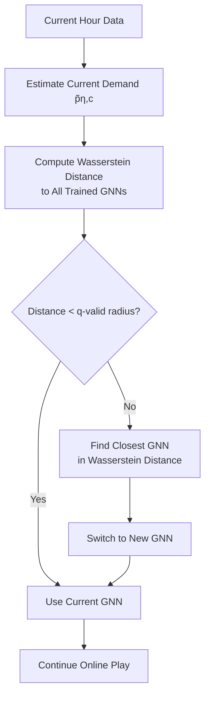
```mermaid
graph TD
    A[Current Hour Data] --> B[Estimate Current Demand p̃η,c]
    B --> C[Compute Wasserstein Distance<br/>to All Trained GNNs]
    C --> D{Distance < q-valid radius?}
    D -->|Yes| E[Use Current GNN]
    D -->|No| F[Find Closest GNN<br/>in Wasserstein Distance]
    F --> G[Switch to New GNN]
    G --> E
    E --> H[Continue Online Play]
```

### Benefits
- **Automatic adaptation**: No manual intervention
- **Principled switching**: Based on statistical guarantees
- **Performance recovery**: Maintains online play advantages

---


# Extended Presentation: Missing Technical Components
## Multiagent RL for Autonomous Taxi Routing

---

## Dynamic Programming Formulation

### Bellman Equation - The Core Optimization
```
μ*ₖ(xₖ) ∈ argmin E[gₖ(xₖ, uₖ, η, ρ, δ) + J*ₖ₊₁(xₖ₊₁)]
         uₖ∈Uₖ(xₖ)
```

**Terms Explained:**
- **μ*ₖ**: Optimal policy at time k
- **gₖ**: Stage cost = |r̄ₖ| (number of waiting requests)  
- **J*ₖ₊₁**: Future optimal cost-to-go
- **η, ρ, δ**: Random variables (arrivals, pickup, dropoff)

### Why This Formulation?
- **Finite horizon**: N = 60 minutes
- **Stochastic**: Unknown future requests
- **Separable control**: Each taxi has independent action space

---

## State Transition Dynamics

### State Evolution Process
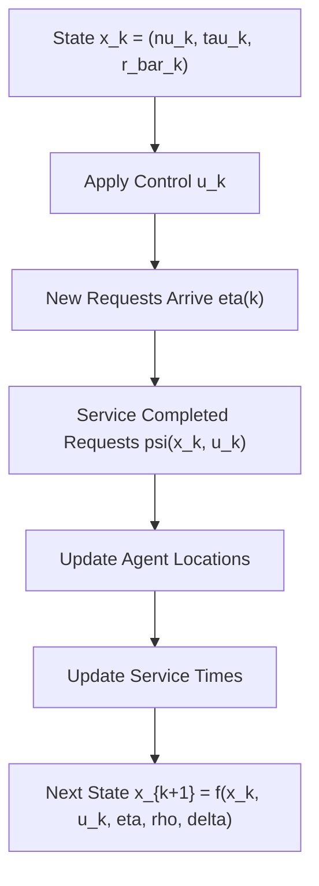
```mermaid
graph TD
    A["State x_k = (nu_k, tau_k, r_bar_k)"] --> B["Apply Control u_k"]
    B --> C["New Requests Arrive eta(k)"]
    C --> D["Service Completed Requests psi(x_k, u_k)"]
    D --> E["Update Agent Locations"]
    E --> F["Update Service Times"]
    F --> G["Next State x_{k+1} = f(x_k, u_k, eta, rho, delta)"]
```

### Outstanding Requests Update
**|r̄ₖ| = |r̄ₖ₋₁| + η(k) - ψ(xₖ, uₖ)**

- **η(k)**: New arrivals at time k
- **ψ(xₖ, uₖ)**: Requests serviced by action uₖ

---

## Control Space Structure

### Agent Control Logic
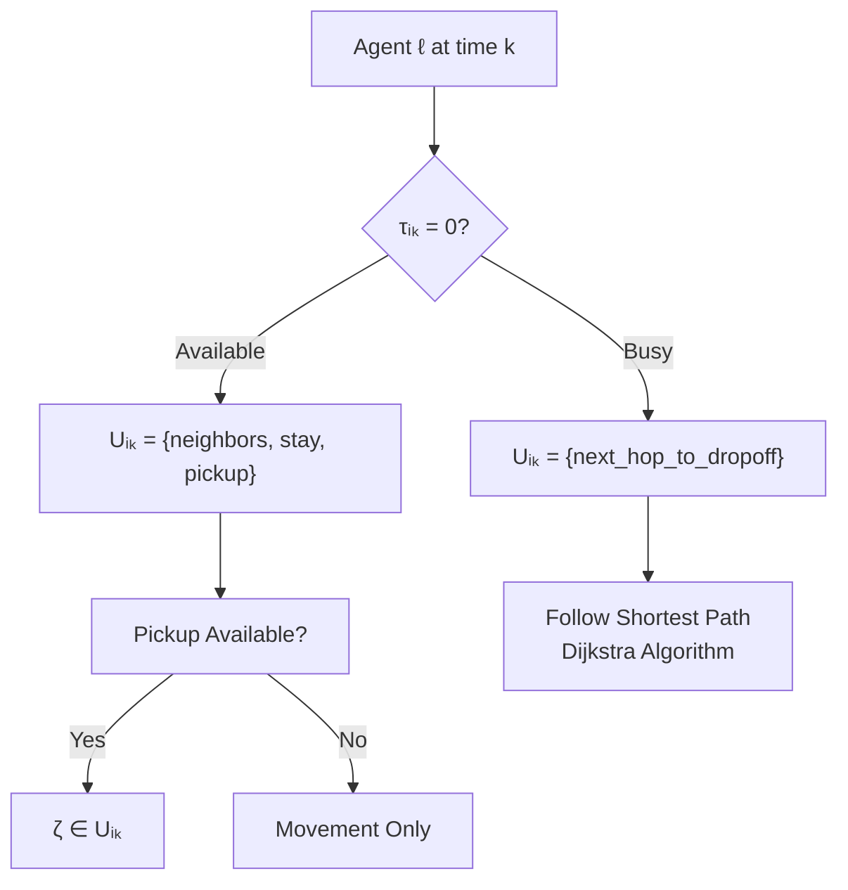
```mermaid
graph TD
    A["Agent ℓ at time k"] --> B{τᵢₖ = 0?}
    B -->|Available| C["Uᵢₖ = {neighbors, stay, pickup}"]
    B -->|Busy| D["Uᵢₖ = {next_hop_to_dropoff}"]
    C --> E[Pickup Available?]
    E -->|Yes| F[ζ ∈ Uᵢₖ]
    E -->|No| G[Movement Only]
    D --> H[Follow Shortest Path<br/>Dijkstra Algorithm]
```

### Separable Control Constraint
**Uₖ(xₖ) = U¹ₖ(xₖ) × U²ₖ(xₖ) × ... × Uᵐₖ(xₖ)**

---

## Training Data Generation Pipeline

### Rollout Training Process
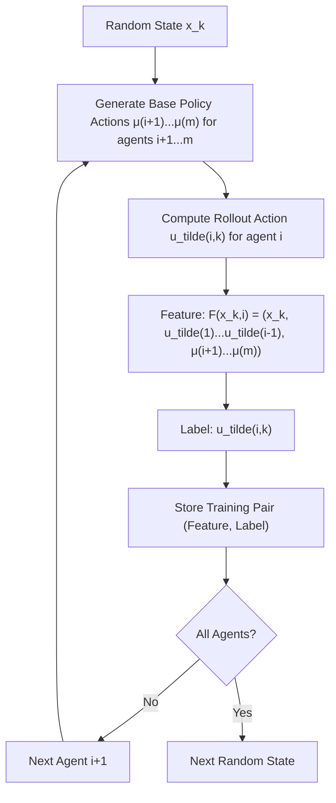
```mermaid
flowchart TD
    A["Random State x_k"] --> B["Generate Base Policy Actions μ(i+1)...μ(m) for agents i+1...m"]
    B --> C["Compute Rollout Action u_tilde(i,k) for agent i"]
    C --> D["Feature: F(x_k,i) = (x_k, u_tilde(1)...u_tilde(i-1), μ(i+1)...μ(m))"]
    D --> E["Label: u_tilde(i,k)"]
    E --> F["Store Training Pair (Feature, Label)"]
    F --> G{All Agents?}
    G -->|No| H["Next Agent i+1"]
    H --> B
    G -->|Yes| I["Next Random State"]
```

### Training Statistics
- **Dataset Size**: 1.2M state-action pairs
- **Computation**: 5000 Monte-Carlo simulations per leaf
- **Base Policy**: Greedy nearest-request assignment

---

## GNN Architecture Details

### Node Feature Engineering
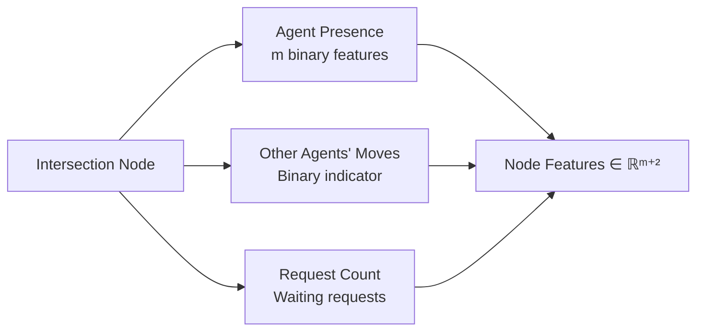
```mermaid
graph LR
    A[Intersection Node] --> B[Agent Presence<br/>m binary features]
    A --> C[Other Agents' Moves<br/>Binary indicator]
    A --> D[Request Count<br/>Waiting requests]
    B --> E[Node Features ∈ ℝᵐ⁺²]
    C --> E
    D --> E
```

### Network Specifications

#### Pickup Network
- **Graph Conv Layers**: 3 layers
- **Linear Layers**: 3 layers  
- **Output**: Binary decision (pickup/no pickup)

#### Move Network
- **Graph Conv Layers**: 2 layers
- **Linear Layers**: 4 layers
- **Output**: Next intersection index

### Training Hyperparameters
- **Optimizer**: Adam
- **Learning Rates**: 0.005 (pickup), 0.002 (move)
- **Regularization**: 10⁻⁵ L2 penalty
- **Epochs**: 100

---

## Wasserstein Distance Computation

### Mathematical Definition
```
dw(p̃η,c, p̃η) = inf Σ fᵢⱼ ||ξⱼc - ξᵢ||
                f≥0 i,j
```

**Subject to:**
- **Marginal constraints**: Σⱼ fᵢⱼ = pᵢ, Σᵢ fᵢⱼ = pⱼc
- **fᵢⱼ**: Transportation plan (probability mass movement)

### Physical Interpretation
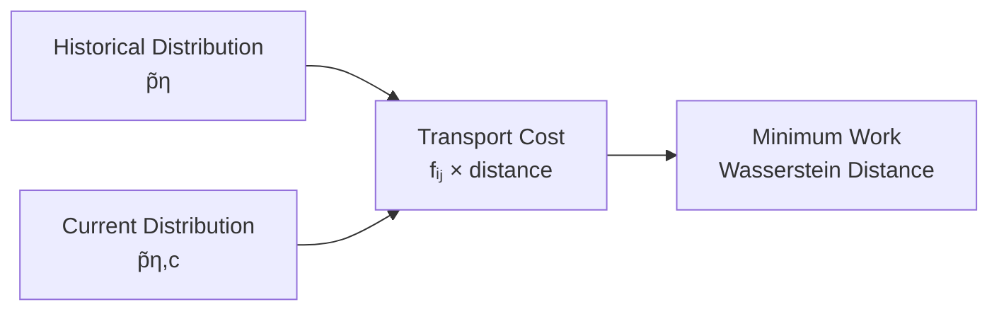
```mermaid
graph LR
    A[Historical Distribution<br/>p̃η] --> B[Transport Cost<br/>fᵢⱼ × distance]
    C[Current Distribution<br/>p̃η,c] --> B
    B --> D[Minimum Work<br/>Wasserstein Distance]
```

---

## q-Valid Radius Computation

### Statistical Guarantee Formula
```
θ ≥ (B + 0.75)(√(-log(1-q)/X) + 2√(-log(1-q)/X))
```

**Parameter Definitions:**
- **B**: Support diameter (max requests/minute = 6)
- **X**: Sample size (5000 Monte-Carlo samples)
- **q**: Confidence level (0.54 = 54%)
- **θ**: Minimum radius for validity guarantee

### Ambiguity Set Definition
**Dw := {pη,c ∈ P(Ω) | dw(pη,c, p̃η) < θ}**

---

## Certainty Equivalence for Scaling

### Standard vs. Certainty Equivalence
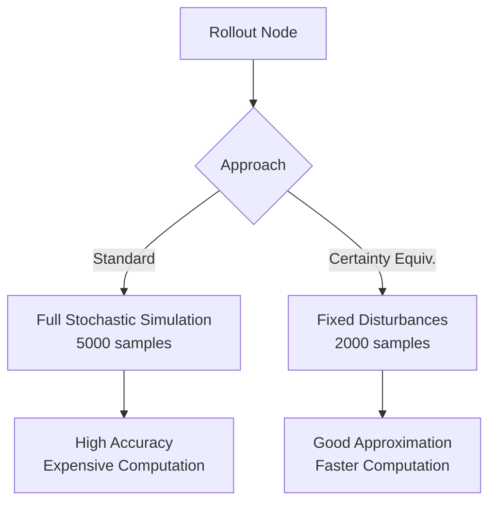
```mermaid
graph TD
    A[Rollout Node] --> B{Approach}
    B -->|Standard| C[Full Stochastic Simulation<br/>5000 samples]
    B -->|Certainty Equiv.| D[Fixed Disturbances<br/>2000 samples]
    C --> E[High Accuracy<br/>Expensive Computation]
    D --> F[Good Approximation<br/>Faster Computation]
```

### Implementation Details
- **Fixed η, ρ, δ**: Across rollout steps
- **Preserved stochasticity**: Request arrival order, pickup-dropoff pairing
- **Base policy**: Auction algorithm for instantaneous assignment
- **Reduction**: 5000 → 2000 Monte-Carlo simulations

---

## Algorithm Complexity Analysis

### Computational Complexity Comparison
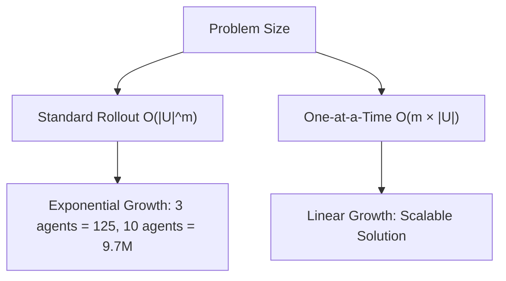
```mermaid
graph TD
    A["Problem Size"] --> B["Standard Rollout O(|U|^m)"]
    A --> C["One-at-a-Time O(m × |U|)"]
    B --> D["Exponential Growth: 3 agents = 125, 10 agents = 9.7M"]
    C --> E["Linear Growth: Scalable Solution"]
```

### Space Complexity
- **State Space**: O(|V|ᵐ × (|V|²)^|requests|)
- **Example (small map)**: 10⁷⁸ states
- **Example (large map)**: 10⁴⁵⁹ states

---

## Performance Analysis Deep Dive

### Cost Improvement Property
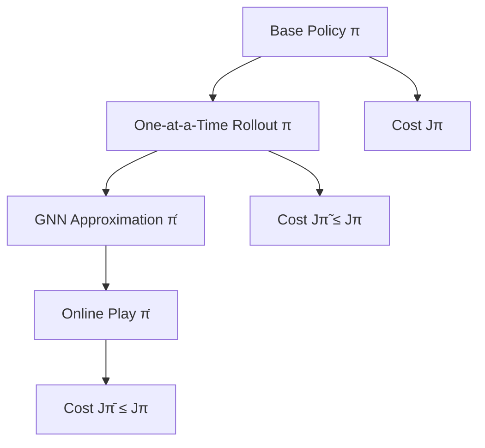
```mermaid
graph TD
    A[Base Policy π] --> B[One-at-a-Time Rollout π̃]
    B --> C[GNN Approximation π̂]
    C --> D[Online Play π̄]
    A --> E[Cost Jπ]
    B --> F[Cost Jπ̃ ≤ Jπ]
    D --> G[Cost Jπ̄ ≤ Jπ̃]
```

### Theoretical Guarantees
- **Rollout Property**: Guaranteed improvement over base policy
- **Online Play**: Approximate policy iteration step
- **Convergence**: When GNN approximation is accurate

---

## Demand Model Estimation

### Historical vs. Current Models
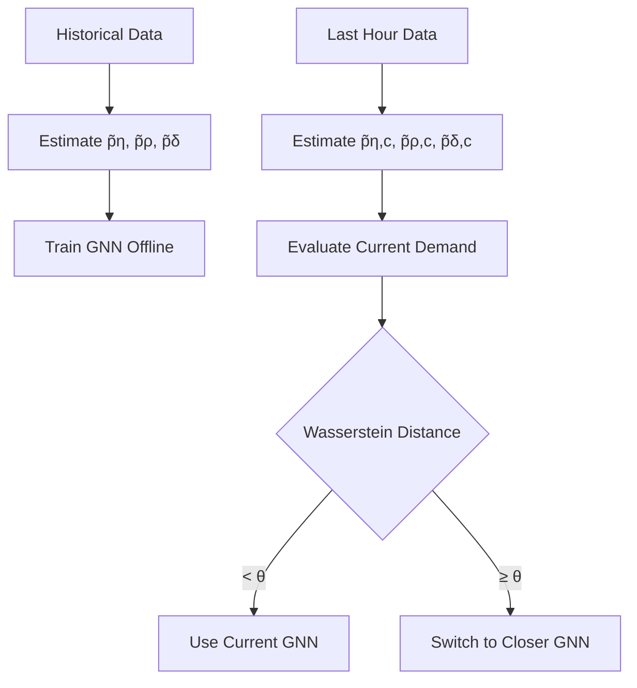
```mermaid
graph TD
    A[Historical Data] --> B[Estimate p̃η, p̃ρ, p̃δ]
    C[Last Hour Data] --> D[Estimate p̃η,c, p̃ρ,c, p̃δ,c]
    B --> E[Train GNN Offline]
    D --> F[Evaluate Current Demand]
    F --> G{Wasserstein Distance}
    G -->|< θ| H[Use Current GNN]
    G -->|≥ θ| I[Switch to Closer GNN]
```

### Probability Estimation
**p̃ρ(y) = (sy + 1/|V|)/(1 + Σⱼ∈V sⱼ)**

- **sy**: Historical requests at location y
- **Smoothing**: Small probability (1/|V|) for all locations

---

## Experimental Design Details

### Evaluation Protocol
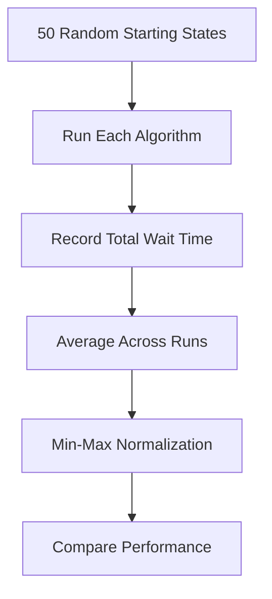
```mermaid
graph TD
    A[50 Random Starting States] --> B[Run Each Algorithm]
    B --> C[Record Total Wait Time]
    C --> D[Average Across Runs]
    D --> E[Min-Max Normalization]
    E --> F[Compare Performance]
```

### Normalization Formula
**J̄ᵖᵃʳᵐ = (J̄π - min J̄π') / (max J̄π' - min J̄π')**

- **Range**: [0, 1] for fair comparison
- **0**: Best performing method
- **1**: Worst performing method

---

## Comprehensive Questions & Answers

### Q1: What is Monte Carlo Simulation and why use it?
**Answer:**
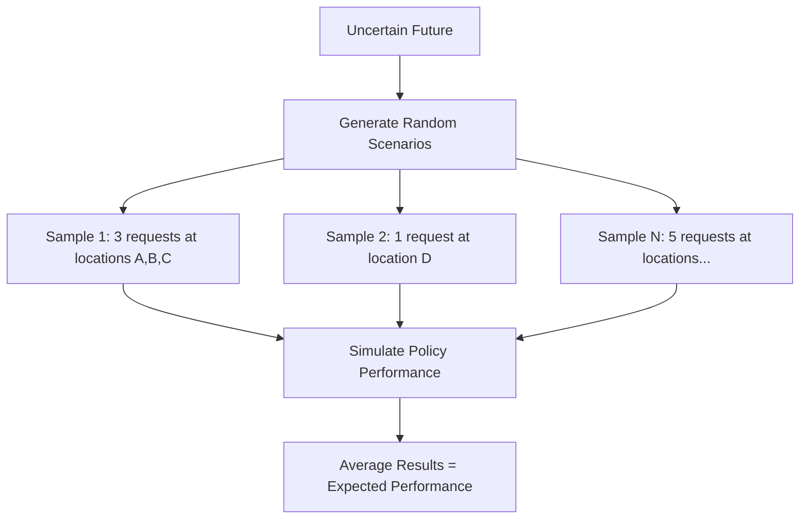
```mermaid
graph TD
    A[Uncertain Future] --> B[Generate Random Scenarios]
    B --> C[Sample 1: 3 requests at locations A,B,C]
    B --> D[Sample 2: 1 request at location D]
    B --> E[Sample N: 5 requests at locations...]
    C --> F[Simulate Policy Performance]
    D --> F
    E --> F
    F --> G[Average Results = Expected Performance]
```
**Why Monte Carlo?**
- **Handles Uncertainty**: Unknown future requests (η), pickup (ρ), dropoff (δ)
- **Expectation Estimation**: E[cost] ≈ (1/N) Σ cost_samples
- **Better than Analytical**: Complex stochastic dependencies

---

### Q2: What happens when demand distribution changes?
**Answer:**
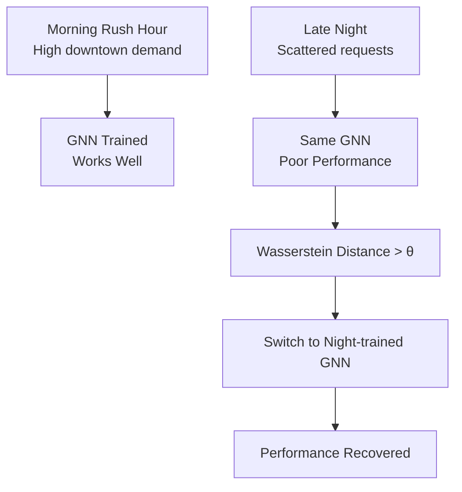
```mermaid
graph TD
    A[Morning Rush Hour<br/>High downtown demand] --> B[GNN Trained<br/>Works Well]
    C[Late Night<br/>Scattered requests] --> D[Same GNN<br/>Poor Performance]
    D --> E[Wasserstein Distance > θ]
    E --> F[Switch to Night-trained GNN]
    F --> G[Performance Recovered]
```
**Real Examples:**
- **Peak → Off-peak**: 25 → 3 requests/hour
- **Business District → Residential**: Different pickup patterns
- **Events**: Concerts, sports games create spikes

---

### Q3: Why Graph Neural Networks over standard Neural Networks?
**Answer:**
- **Topology Awareness**: GNNs exploit street network connectivity
- **Permutation Invariance**: Order of intersection processing doesn't matter
- **Scalability**: Same model works on different map sizes
- **Information Propagation**: Features spread through graph structure

**Example**: Standard NN sees intersections as isolated points, GNN sees connected network

---

### Q4: How does one-agent-at-a-time actually work step by step?
**Answer:**
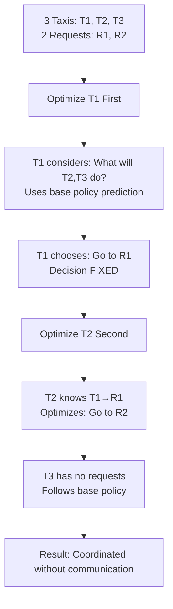
```mermaid
graph TD
    A[3 Taxis: T1, T2, T3<br/>2 Requests: R1, R2] --> B[Optimize T1 First]
    B --> C[T1 considers: What will T2,T3 do?<br/>Uses base policy prediction]
    C --> D[T1 chooses: Go to R1<br/>Decision FIXED]
    D --> E[Optimize T2 Second]
    E --> F[T2 knows T1→R1<br/>Optimizes: Go to R2]
    F --> G[T3 has no requests<br/>Follows base policy]
    G --> H[Result: Coordinated without communication]
```

---

### Q5: What is the base policy and why is it important?
**Answer:**
**Base Policy = Greedy Nearest Request Assignment**
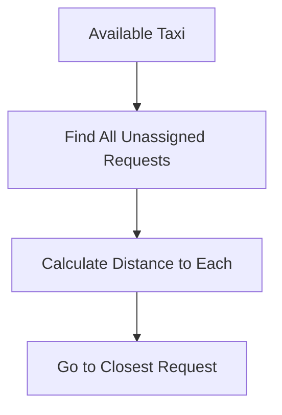
```mermaid
graph TD
    A[Available Taxi] --> B[Find All Unassigned Requests]
    B --> C[Calculate Distance to Each]
    C --> D[Go to Closest Request]
```
**Why Important:**
- **Rollout Foundation**: Provides cost estimates for lookahead
- **Fallback Option**: When sophisticated methods fail
- **Training Labels**: GNN learns to improve over base policy

---

### Q6: How do you handle the curse of dimensionality?
**Answer:**
**Problem Scale:**
- **Small Map**: 10^78 possible states
- **Large Map**: 10^459 possible states
- **Impossible**: To enumerate all states

**Solutions Applied:**
1. **One-at-a-Time**: Exponential → Linear complexity
2. **Sampling**: Monte Carlo instead of exhaustive search
3. **Function Approximation**: GNN learns patterns, not memorize states
4. **Truncated Horizons**: Limited lookahead (t=10 steps)

---

### Q7: What if the GNN completely fails to learn?
**Answer:**
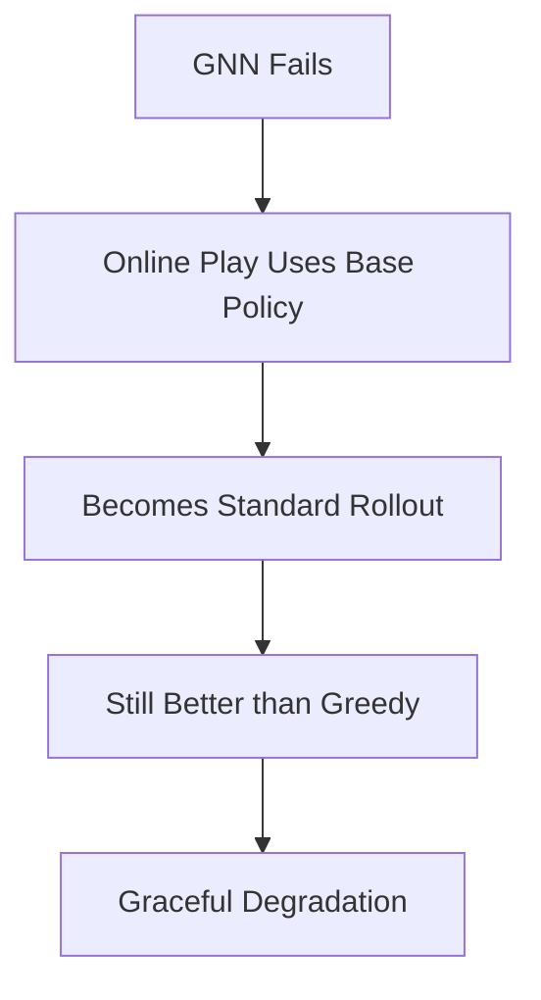
```mermaid
graph TD
    A["GNN Fails"] --> B["Online Play Uses Base Policy"]
    B --> C["Becomes Standard Rollout"]
    C --> D["Still Better than Greedy"]
    D --> E["Graceful Degradation"]
```
**Safety Mechanisms:**
- **Never Worse**: Than one-at-a-time rollout
- **Bounded Performance**: Mathematical guarantees exist
- **Fallback Ready**: Always have base policy available

---

### Q8: How do you validate that Wasserstein distance switching works?
**Answer:**
**Experimental Evidence:**
- **Within q-valid radius**: Performance maintained (0.57-0.63)
- **Outside radius**: Performance degrades (0.73-0.98)
- **After switching**: 9% improvement recovered

**Example Scenario:**
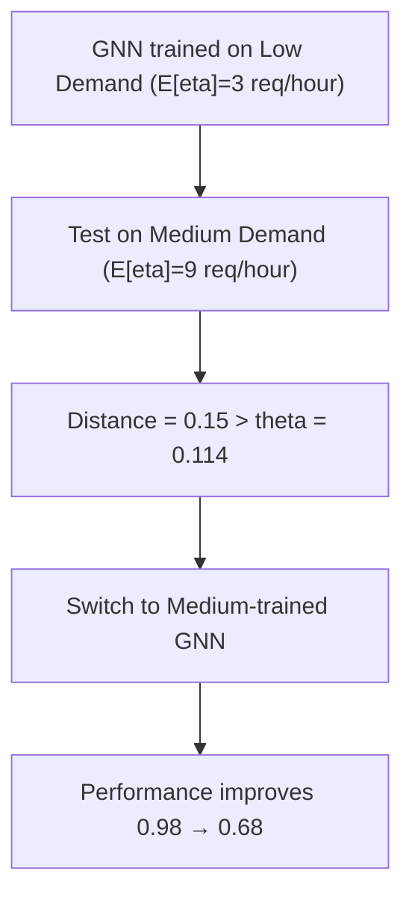
```mermaid
graph TD
    A["GNN trained on Low Demand (E[eta]=3 req/hour)"] --> B["Test on Medium Demand (E[eta]=9 req/hour)"]
    B --> C["Distance = 0.15 > theta = 0.114"]
    C --> D["Switch to Medium-trained GNN"]
    D --> E["Performance improves 0.98 → 0.68"]
```

---

### Q9: Why use 1-step lookahead instead of longer horizons?
**Answer:**
**Trade-offs:**
- **1-step**: Fast, practical, proven improvement
- **Multi-step**: Exponentially expensive, marginal gains

**Computational Cost:**
```
1-step: O(|actions| × samples)
2-step: O(|actions|² × samples)  
N-step: O(|actions|^N × samples)
```
**Research Shows**: 1-step captures most coordination benefits

---

### Q10: How does this handle real-time constraints?
**Answer:**
**Timing Requirements:**
- **Decision Window**: ~1 minute per time step
- **GNN Inference**: Milliseconds
- **Monte Carlo**: Parallelizable
- **Total Runtime**: Seconds (acceptable for real dispatch)

**Scalability Strategy:**
```mermaid
graph TD
    A["Real-time Constraint"] --> B["Offline GNN Training (16 hours acceptable)"]
    A --> C["Online Inference (must be < 60 seconds)"]
    B --> D["Pre-computed Approximations"]
    C --> E["Fast Rollout Execution"]
    D --> E
    E --> F["Real-time Decisions"]
```

---

### Q11: What about travel time uncertainties and traffic?
**Answer:**
**Current Limitation:**
- **Fixed Travel Times**: 1 minute per edge
- **No Traffic Modeling**: Assumes constant conditions

**Future Extensions:**
- **Dynamic Edge Weights**: Traffic-dependent travel times
- **Uncertainty Propagation**: Stochastic travel time distributions
- **Real-time Updates**: GPS/traffic data integration

---

### Q12: How do you ensure the method works across different cities?
**Answer:**
**Generalization Strategy:**
```mermaid
graph TD
    A["City A Training"] --> B["GNN Learns Graph Patterns"]
    B --> C["Transfer to City B"]
    C --> D["Fine-tune on Local Data"]
    D --> E["Adapt Demand Models"]
```
**Requirements:**
- **Graph Structure**: Method works on any street network
- **Demand Adaptation**: Wasserstein switching handles local patterns  
- **Feature Engineering**: Node features are city-agnostic

---

### Q13: What is the significance of the 9% performance improvement?
**Answer:**
**Real-world Impact:**
- **Customer Experience**: 9% less waiting time
- **Fleet Efficiency**: Serve more customers with same resources
- **Revenue**: Higher customer satisfaction → more rides

**Scale Example:**
```
NYC Yellow Taxi: ~500,000 rides/day
9% improvement = 45,000 rides with better experience
Average wait reduction: 1-2 minutes per ride
```

---

### Q14: How do you handle computational failures or system crashes?
**Answer:**
**Robustness Mechanisms:**
1. **Stateless Design**: Each decision independent
2. **Fallback Policies**: Always have greedy backup
3. **Distributed Architecture**: No single point of failure
4. **Graceful Degradation**: Performance reduces, doesn't crash

**Recovery Process:**
```mermaid
graph TD
    A["System Failure"] --> B["Detect Issue"]
    B --> C["Switch to Base Policy"]
    C --> D["Continue Operations"]
    D --> E["Restore Full System"]
    E --> F["Resume Optimal Performance"]
```

---

### Q15: Can this method work with electric vehicle constraints?
**Answer:**
**Additional Considerations:**
- **Battery State**: Add to agent state τₖ
- **Charging Stations**: Special nodes in graph
- **Range Constraints**: Modified control space
- **Charging Time**: Extended service times

**Modified State:**
```
xₖ = (νₖ, τₖ, battery_levels, r̄ₖ)
```
**GNN Extension**: Additional node features for charging infrastructure

---

### Q16: What about passenger cancellations or no-shows?
**Answer:**
**Current Model**: Assumes all requests are valid
**Real Extensions Needed:**
- **Cancellation Probability**: p_cancel(request, wait_time)
- **Dynamic Request Removal**: Update r̄ₖ in real-time  
- **Cost Function**: Penalty for unnecessary trips

**Implementation:**
```mermaid
graph TD
    graph TD
    A["Request Assigned"] --> B["Taxi En Route"]
    B --> C{"Passenger Cancels?"}
    C -->|Yes| D["Remove from r_bar_k and Reassign Taxi"]
    C -->|No| E["Complete Pickup"]
```

---

## Future Research Directions

### Immediate Extensions
```mermaid
graph TD
    A[Current Work] --> B[Traffic-Aware Routing]
    A --> C[Multi-Passenger Support]
    A --> D[Predictive Demand Switching]
    A --> E[Hierarchical City Decomposition]
```

### Long-term Vision
- **Dynamic Pricing**: Demand-responsive pricing integration
- **Multi-Modal Transport**: Buses, trains, shared vehicles
- **Uncertainty Quantification**: Confidence bounds on decisions
- **Federated Learning**: Privacy-preserving multi-city training

---

## Key Technical Insights

### Why This Approach Works
✅ **Scalable Approximation**: Linear complexity rollout  
✅ **Structure Exploitation**: GNN leverages city topology  
✅ **Real-time Adaptation**: Online play corrects offline errors  
✅ **Statistical Guarantees**: Principled switching mechanism  

### Broader Impact
- **Algorithmic**: Template for multi-agent coordination
- **Practical**: Deployable in real ride-sharing systems  
- **Theoretical**: Advances in rollout and online play
- **Societal**: Reduced wait times, better urban mobility

## Experimental Setup

### Dataset
- **Source**: San Francisco taxi data (CRAWDAD)
- **Small map**: 400×400m², 42 nodes, 125 edges, 3 taxis
- **Large map**: 1500×1500m², 825 nodes, 1884 edges, 15 taxis

### Demand Models
- **Low demand**: E[η]·N = 3 requests/hour
- **Medium demand**: E[η]·N = 9 requests/hour  
- **High demand**: E[η]·N = 25 requests/hour

### Training Details
- **Data**: 1.2M state-action pairs
- **Epochs**: 100
- **Training time**: 16h (move), 6h (pickup) on RTX A6000

---

## Benchmark Comparisons

### Evaluated Methods
1. **Greedy**: Nearest-request assignment (myopic)
2. **One-at-a-time rollout**: Reference planner (expensive)
3. **GNN alone**: Offline approximation only
4. **Online play + GNN**: Our hybrid method
5. **Instantaneous assignment**: Deterministic matching
6. **TSS**: Two-step stochastic optimization
7. **Oracle**: Perfect future knowledge (lower bound)

### Evaluation Metric
- **Normalized wait time**: [0,1] scale using min-max normalization
- **Average**: Over 50 random starting configurations

---

## Results - In-Distribution Performance

### When Current = Training Demand

| Method | Low Demand | Medium Demand | High Demand |
|--------|------------|---------------|-------------|
| **Greedy** | 0.94 | 0.99 | 1.0 |
| **Rollout** | 0.62 | 0.65 | 0.58 |
| **GNN alone** | 0.58 | 0.68 | 0.65 |
| **Online play + GNN** | **0.57** | **0.62** | **0.50** |
| **Oracle** | 0.0 | 0.0 | 0.0 |

### Key Findings
- **Online play + GNN**: Best performance across all scenarios
- **Improvement**: 8-14% better than rollout
- **Consistency**: Maintains advantage across demand levels

---

## Results - Out-of-Distribution Robustness

### Performance vs Wasserstein Distance

| Method | Distance: 0.0 | 0.017 | 0.067 | **0.117** | 0.15 | 0.35 |
|--------|---------------|--------|--------|-----------|------|------|
| **GNN (low)** | 0.62 | 0.62 | 0.73 | **0.74** | 0.98 | 1.0 |
| **Online play** | 0.61 | 0.57 | 0.63 | **0.73** | 0.68 | 0.52 |

*q-valid radius = 0.114*

### Observations
- **Within radius** (≤0.067): Excellent performance
- **Outside radius** (>0.117): Performance degrades
- **Switching recovery**: 9% improvement when switching GNNs

---

## Scalability Results

### Large Map Performance (825 nodes, 15 taxis)

| Demand | Greedy | Inst. Assign | Our Method | Oracle |
|--------|---------|-------------|------------|---------|
| **Low** | 1.0 | 0.86 | **0.77** | 0.0 |
| **Medium** | 1.0 | 0.86 | **0.83** | 0.0 |
| **High** | 1.0 | 0.99 | **0.89** | 0.0 |

### Scalability Adaptations
- **Certainty Equivalence**: Reduced stochastic simulations
- **Auction-based base**: Instantaneous assignment starting point
- **Fewer samples**: 2000 vs 5000 Monte Carlo per leaf

---

## Technical Contributions

### Novel Aspects
1. **Hybrid Architecture**: Offline GNN + Online optimization
2. **Principled Adaptivity**: Wasserstein Ambiguity Sets for switching
3. **Scalable Rollout**: One-at-a-time for linear complexity
4. **Graph-based Learning**: GNN exploits city topology

### Theoretical Guarantees
- **Rollout improvement**: One-at-a-time guarantees better than base
- **Online play**: Approximate policy iteration properties
- **Statistical validity**: q-valid radius with probability guarantees

---

## Limitations & Future Work

### Current Limitations
- **Single passenger**: No ride-sharing capability
- **Fixed travel times**: No traffic/congestion modeling
- **Training cost**: Expensive GNN preparation offline
- **Reactive switching**: Responds to changes, doesn't predict

### Future Directions
1. **Proactive switching**: Predict demand changes
2. **Multi-passenger**: Ride-sharing extensions
3. **Dynamic travel times**: Traffic-aware routing
4. **Hierarchical scaling**: Regional decomposition for large cities

---

## Key Takeaways

### Main Results
✅ **Outperforms** rollout and OR benchmarks on real taxi data  
✅ **Adapts automatically** to changing demand patterns  
✅ **Scales linearly** with number of taxis (vs exponential)  
✅ **Real-time capable** through offline-online hybrid approach  

### Practical Impact
- **Ride-sharing companies**: Better customer experience
- **Urban planning**: Efficient fleet management  
- **Autonomous vehicles**: Coordinated routing strategies
- **General multi-agent**: Template for other domains

### Method Applicability
- Package delivery, warehouse robots, emergency response
- Any scenario with: multiple agents, stochastic demand, coordination needs

---
